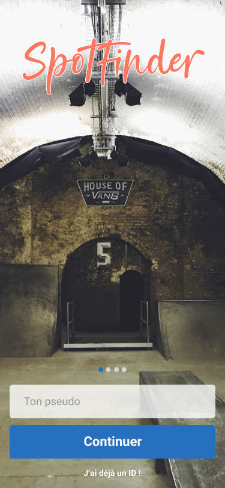
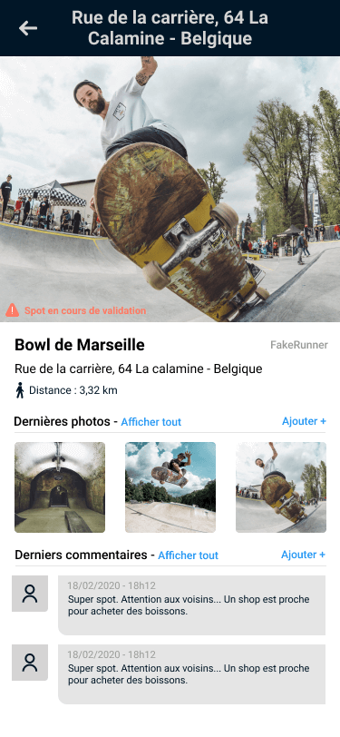
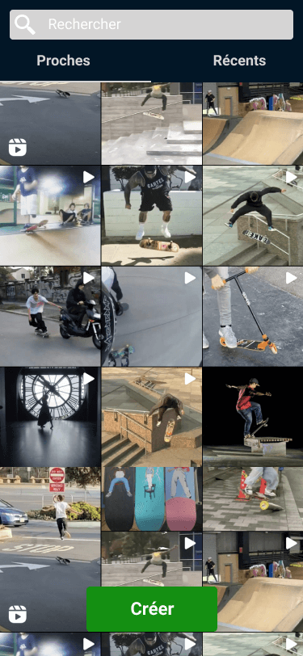
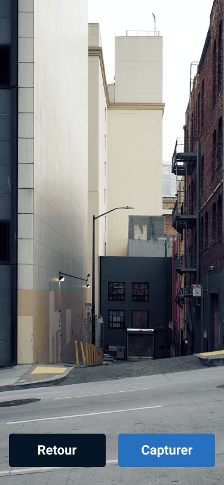

# SpotFinder

Application générique pour localiser, partager, et alimenter des Spots (lieux).

Cette application fonctionne avec un serveur pour centraliser les données : [SpotFinder Backend](https://github.com/remylavergne/spotfinder-backend).

## Ressources 

- UX / UI (en développement continu) : [SpotFinder - Figma Design](https://www.figma.com/file/oeGttvAlx7TPWvUua53yuw/SpotFinder?node-id=26%3A0)

## Captures d'écran

## Resources to see

- [Transitions during navigation](https://medium.com/flutter-community/everything-you-need-to-know-about-flutter-page-route-transition-9ef5c1b32823)

